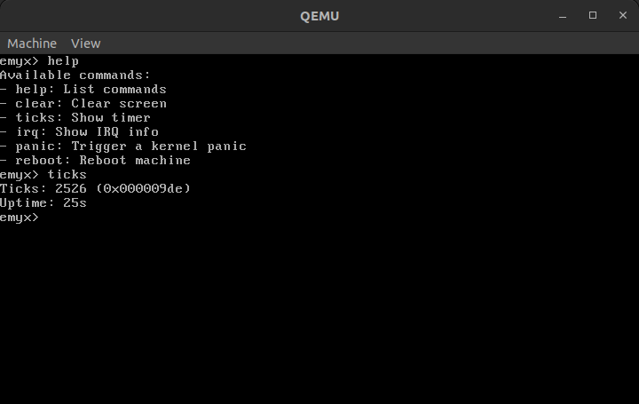

# Emyx

Emyx is an ealry-stage operating system with a kernel and libc written from scratch.



## Progression

- [x] Bootable ISO (GRUB/Multiboot)
- [x] VGA text-mode terminal output
- [x] UART serial debug (COM1)
- [x] GDT and IDT setup and load
- [x] CPU exceptions (0-31) with panic diagnostics
- [x] PIC remap and IRQ controller helpers (mask/unmask, EOI)
- [x] IRQ0 timer ticks (PIT configured)
- [x] IRQ1 keyboard press decoding
- [x] Kernel shell with utility commands (help, clear, ticks, irq, panic, reboot)

## Prerequisites

- Cross toolchain for `i686-elf` (`i686-elf-gcc`, `i686-elf-ar`, ...)
- `grub-mkrescue`
- `qemu-system-i386`

Toolchain setup notes: [docs/cross-compiler.md](docs/cross-compiler.md)

## Quick start

```sh
git clone https://github.com/j1banez/emyx.git
cd emyx
make run
```

Use `make help` for more information.

## Debug

```sh
make gdb

# In another terminal
gdb kernel/emyx.kernel
```

In GDB:
```sh
(gdb) target remote :1234
(gdb) b kmain
(gdb) c
(gdb) bt
(gdb) info registers
(gdb) n
[...]
```
