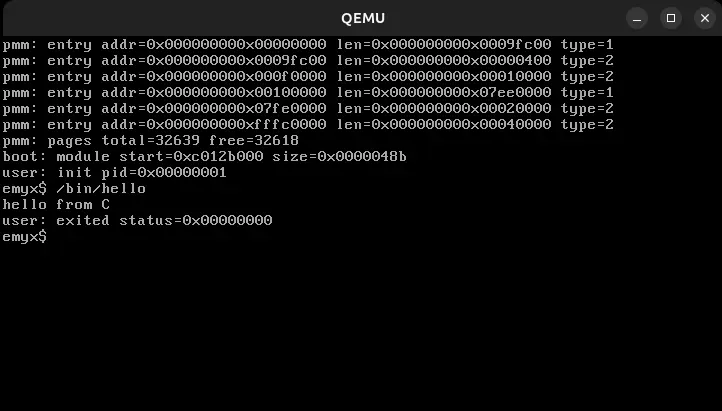

# Emyx

Emyx is an early-stage and experimental operating system with a kernel
and userland written from scratch.



## Current state

- Boots on 32-bit x86 through GRUB
- Handles interrupts, exceptions, the timer, and keyboard input
- Manages physical and virtual memory
- Runs a small heap allocator
- Runs processes in separate address spaces
- Uses cooperative scheduling for now to keep things simple
- Provides basic system calls such as `spawn`, `wait`, and `yield`
- Loads programs from an initramfs
- Starts `/bin/init` as PID 1
- Has a simple shell that can run programs

## Prerequisites

- Cross toolchain for `i686-elf` (`i686-elf-gcc`, `i686-elf-ar`, ...)
- `grub-mkrescue`
- `qemu-system-i386`

Toolchain setup notes: [docs/cross-compiler.md](docs/cross-compiler.md)

## Quick start

```sh
git clone https://github.com/j1banez/emyx.git
cd emyx
make run
```

Use `make help` for more information.

## Debug

```sh
make gdb

# In another terminal
gdb kernel/emyx.kernel
```

In GDB:
```sh
(gdb) target remote :1234
(gdb) b kmain
(gdb) c
(gdb) bt
(gdb) info registers
(gdb) n
[...]
```
